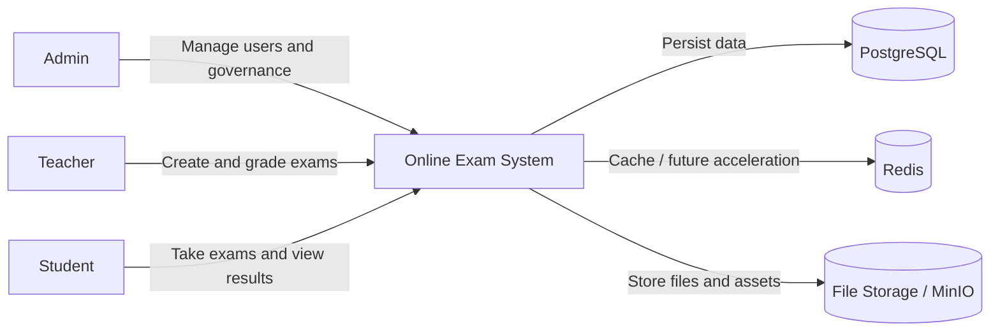
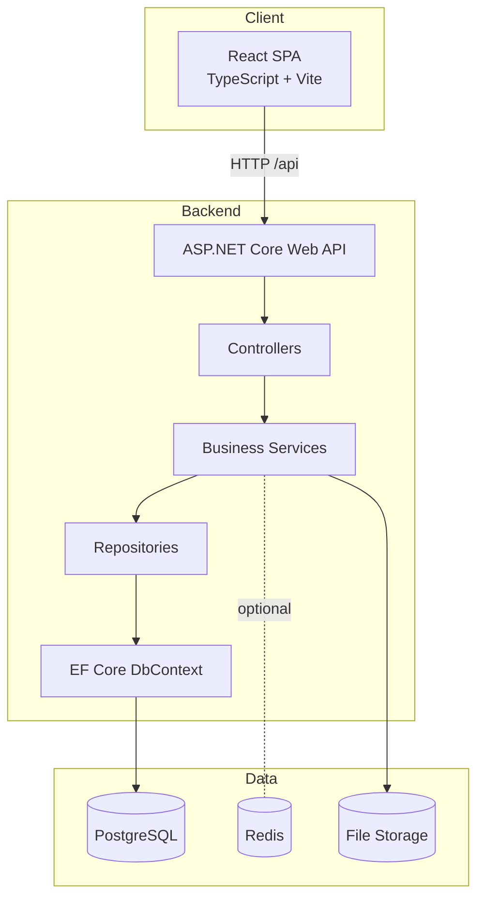

# Architecture Overview

## 1. Purpose

This document provides a delivery-ready architecture overview for Online Exam System.
It describes system boundaries, building blocks, and key technical decisions.

## 2. System Scope

Primary user roles:

- Admin: user governance, system administration
- Teacher: exam authoring, assignment, grading
- Student: exam taking, result review

Primary capabilities:

- Authentication and role-based authorization
- Exam lifecycle management (DRAFT -> ACTIVE -> CLOSED)
- Attempt lifecycle (start, answer, submit, grade, publish)
- Bulk import (teachers, students, questions)
- Notifications and activity logging

## 3. Architectural Style

The solution follows a practical Clean Architecture structure:

- Domain: entities and core business model
- Application: contracts and DTOs
- Infrastructure: repositories and service implementations
- API: controller endpoints, middleware, and composition root

## 4. C4 Level 1 - System Context

## 5. C4 Level 2 - Container Diagram

## 6. Runtime and Middleware

Request pipeline highlights:

- Swagger enabled for API exploration
- Security headers
- CORS policy for frontend client
- JWT authentication and authorization
- Rate limiting profiles (auth and general API)

## 7. Backend Module Responsibilities

- Auth module:
  - Login, register, refresh token, logout, profile, password operations
- Exam module:
  - CRUD, activation/closure, settings, class assignment, exam question mapping
- Attempt and answer module:
  - Start attempt, enforce time/enrollment, answer upsert, submit
- Grading module:
  - Auto-grade objective questions, manual grading, result publication
- Import module:
  - Bulk import from Excel using parser and row-level validation

## 8. Data and Consistency Decisions

- EF Core for ORM and migrations
- Unique index on Answer(ExamAttemptId, QuestionId) to avoid duplicate answers
- Optimistic concurrency on ExamAttempt via RowVersion
- Cascade delete relationships on key dependent records

## 9. Security and Reliability Decisions

- JWT bearer auth with signed tokens
- Role-based endpoint restrictions
- Login and action logging
- Defensive checks in services for ownership, enrollment, and time windows

## 10. Known Constraints

- Core business services currently sit mostly in Infrastructure project.
- Redis is provisioned but not deeply used across all flows yet.
- Frontend token storage is localStorage-based and should be paired with strict frontend hardening.

## 11. Recommended Next Architecture Steps

1. Move orchestration-heavy use cases toward Application services.
2. Centralize authorization policies for resource ownership checks.
3. Introduce idempotency strategy for critical write endpoints.
4. Add ADR records for important technical decisions.
