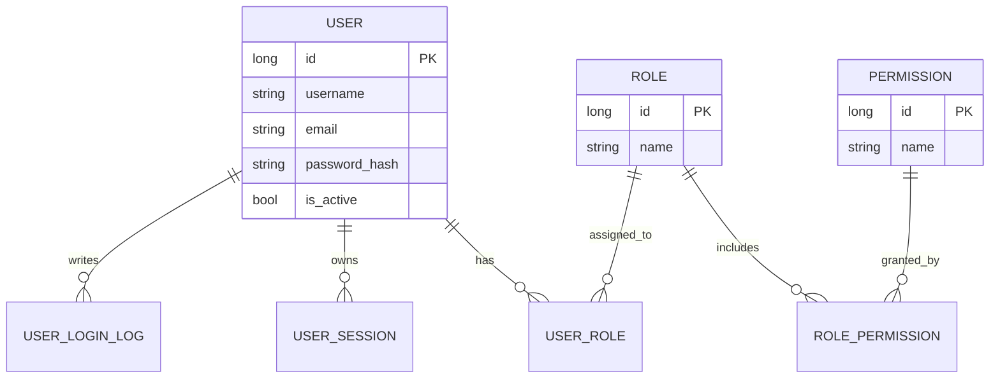
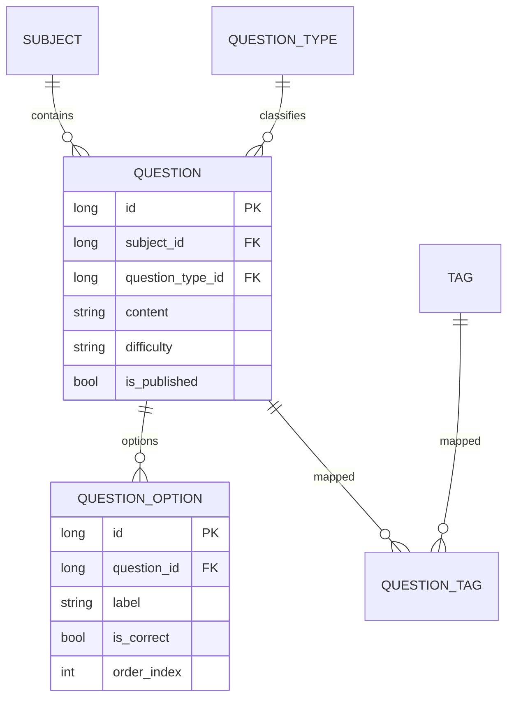
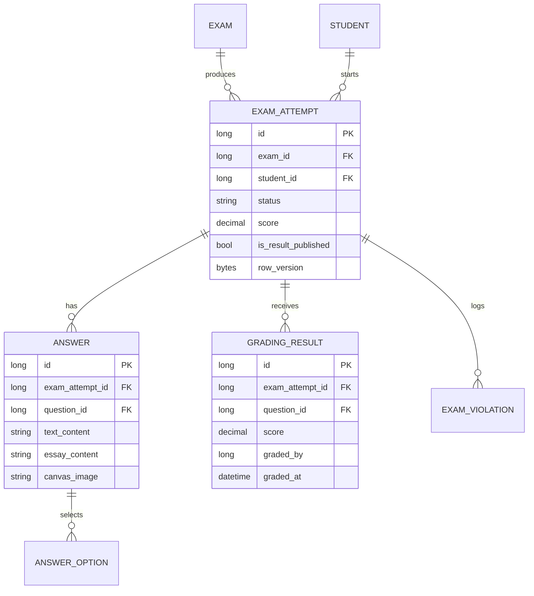
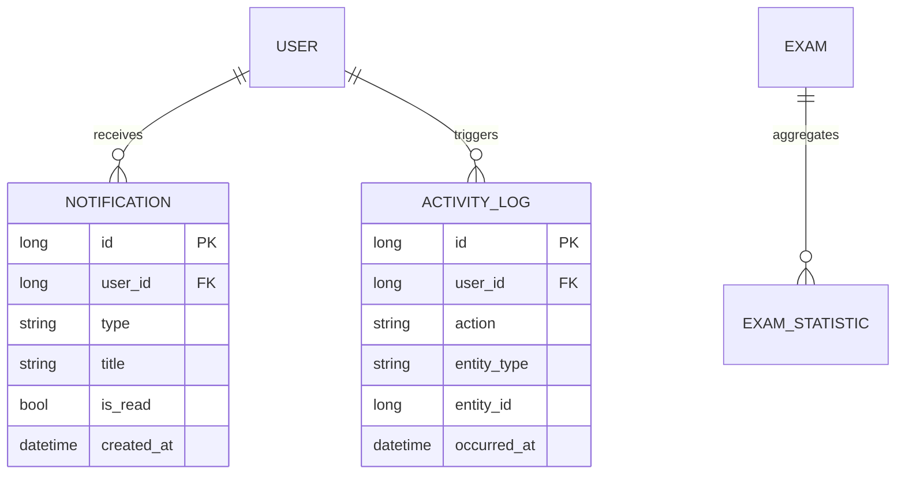

# ERD (Entity Relationship Design)

## 1. Purpose

This ERD document captures the core logical relationships used by Online Exam System.
It is grouped by business domains for delivery and review.

## 2. Core Authentication and Identity ERD



## 3. School and Academic Structure ERD

```mermaid
erDiagram
    SCHOOL ||--o{ CLASS : has
    USER ||--|| TEACHER : profile
    USER ||--|| STUDENT : profile

    CLASS ||--o{ CLASS_TEACHER : mapping
    TEACHER ||--o{ CLASS_TEACHER : mapping
    SUBJECT ||--o{ CLASS_TEACHER : taught_in

    CLASS ||--o{ CLASS_STUDENT : contains
    STUDENT ||--o{ CLASS_STUDENT : enrolled

    SUBJECT ||--o{ SUBJECT_EXAM_TYPE : defines
```

## 4. Exam Authoring and Assignment ERD

```mermaid
erDiagram
    SUBJECT ||--o{ EXAM : groups
    TEACHER ||--o{ EXAM : creates
    SUBJECT_EXAM_TYPE ||--o{ EXAM : categorizes

    EXAM ||--|| EXAM_SETTING : configured_by

    EXAM ||--o{ EXAM_CLASS : assigned_to
    CLASS ||--o{ EXAM_CLASS : receives

    EXAM ||--o{ EXAM_QUESTION : includes
    QUESTION ||--o{ EXAM_QUESTION : referenced

    EXAM {
      long id PK
      long subject_id FK
      long created_by FK
      string title
      int duration_minutes
      string status
    }

    EXAM_SETTING {
      long id PK
      long exam_id FK
      bool shuffle_questions
      bool allow_late_submission
      int grace_period_minutes
      decimal late_penalty_percent
    }
```

## 5. Question Bank ERD



## 6. Attempt, Answer, and Grading ERD



## 7. Notifications, Logs, and Analytics ERD



## 8. Integrity and Key Constraints

- Composite keys:
  - UserRole(UserId, RoleId)
  - RolePermission(RoleId, PermissionId)
  - ExamClass(ExamId, ClassId)
  - ClassStudent(ClassId, StudentId)
  - QuestionTag(QuestionId, TagId)
  - AnswerOption(AnswerId, OptionId)
- Uniqueness:
  - Users.username
  - Users.email
  - UserSessions.refresh_token
  - Students.student_code
  - Teachers.employee_id
  - Answers(exam_attempt_id, question_id)
- Concurrency:
  - ExamAttempt.row_version
