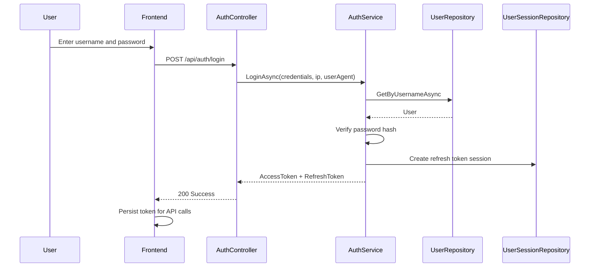
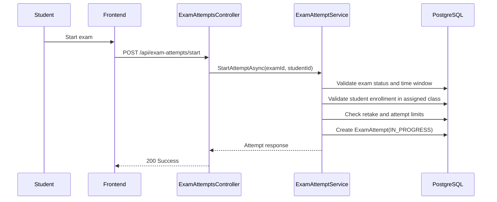
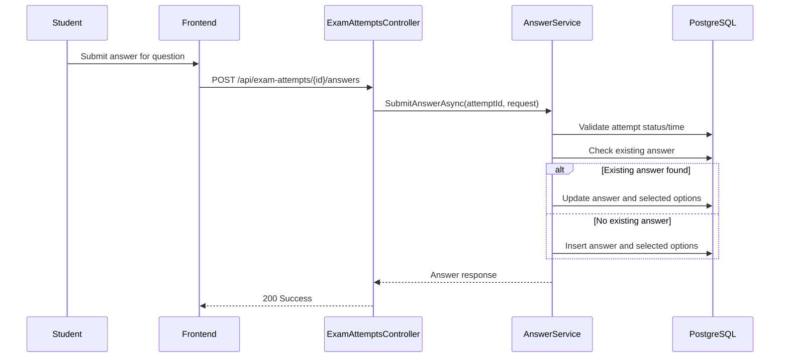
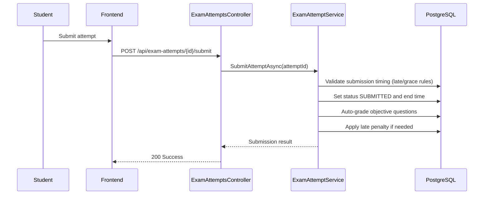
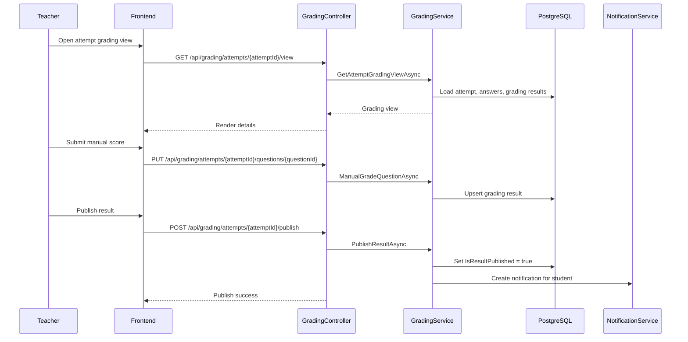
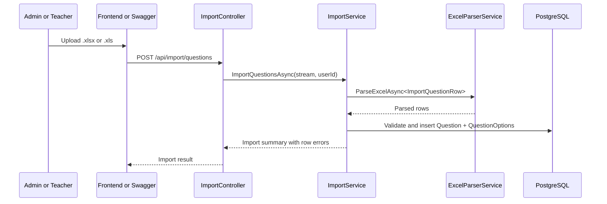

# Sequence Flows

## 1. Authentication Flow

## 2. Start Exam Attempt

## 3. Submit or Update Answer

## 4. Submit Attempt and Auto-Grade

## 5. Manual Grading and Publish Result

## 6. Bulk Import Questions (Current Active Path)

## 7. Notes

- PdfImportService exists in codebase and can be used for a future PDF import endpoint.
- Current controller-level import endpoints enforce Excel extensions.
