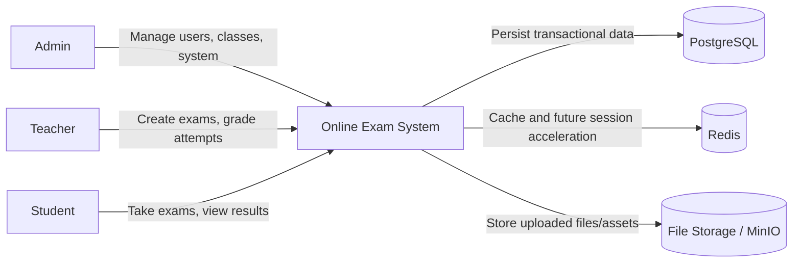
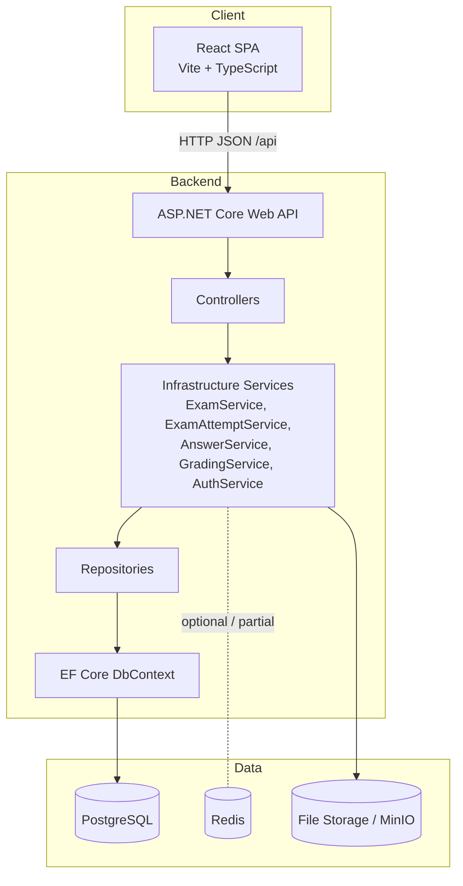
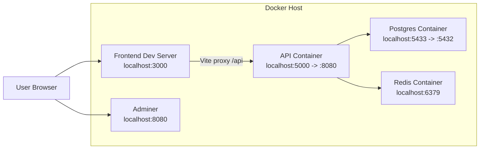
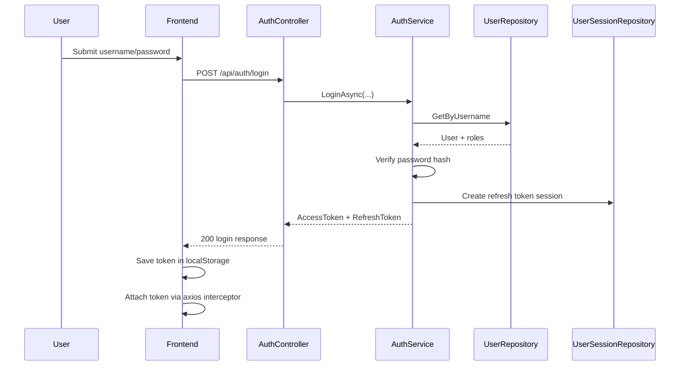
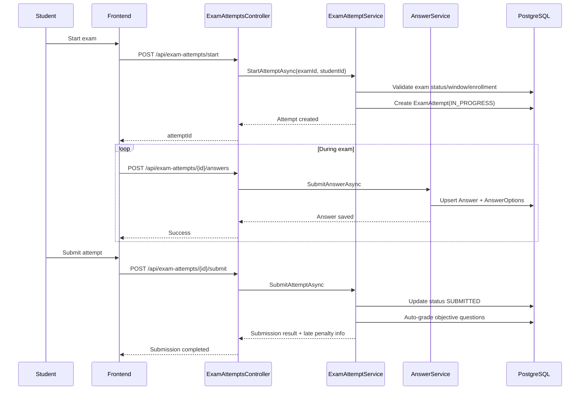
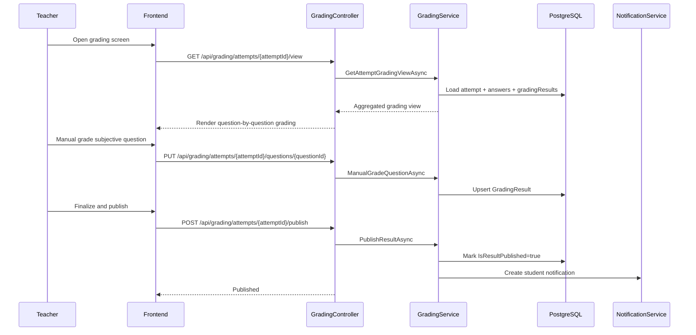
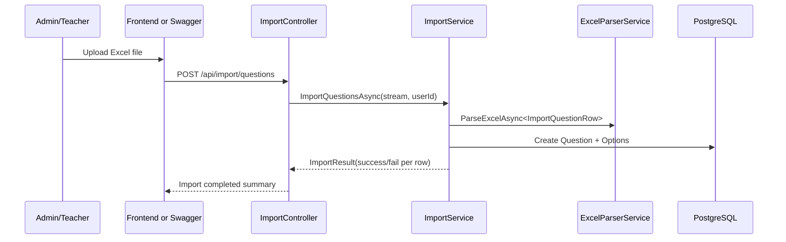

# System Design Analysis and Architecture Diagrams

## 1. Scope and Method

This document is based on a source-level review of the current implementation in:

- Backend API bootstrapping and middleware
- Domain entities and EF Core model configuration
- Core services for auth, exam lifecycle, answer handling, grading, and import
- Frontend routing, auth context, and API client behavior
- Runtime topology from docker-compose

Primary references in source tree:

- src/OnlineExamSystem.API/Program.cs
- src/OnlineExamSystem.API/Controllers/
- src/OnlineExamSystem.Domain/Entities/AllEntities.cs
- src/OnlineExamSystem.Infrastructure/Data/ApplicationDbContext.cs
- src/OnlineExamSystem.Infrastructure/Services/
- frontend/src/App.tsx
- frontend/src/contexts/AuthContext.tsx
- frontend/src/api/client.ts
- docker-compose.yml

## 2. Architectural Summary

The system follows a practical Clean Architecture style with 4 projects:

- OnlineExamSystem.Domain: business entities
- OnlineExamSystem.Application: DTOs and interfaces/contracts
- OnlineExamSystem.Infrastructure: repositories, EF Core, service implementations
- OnlineExamSystem.API: controllers, middleware, runtime composition

Notes from implementation:

- Most business logic implementations currently live in Infrastructure services.
- API enforces JWT authentication, role-based authorization, CORS, and fixed-window rate limits.
- Data persistence is PostgreSQL via EF Core.
- Redis is provisioned in infrastructure but currently not deeply integrated in reviewed core flows.

## 3. C4 Level 1 - System Context



## 4. C4 Level 2 - Container Diagram



## 5. Runtime Deployment View



## 6. Core Domain Model (High-Level ER)

```mermaid
erDiagram
    USER ||--o{ USER_ROLE : has
    ROLE ||--o{ USER_ROLE : grants
    ROLE ||--o{ ROLE_PERMISSION : includes
    PERMISSION ||--o{ ROLE_PERMISSION : defines

    USER ||--|| TEACHER : profile
    USER ||--|| STUDENT : profile

    SCHOOL ||--o{ CLASS : owns
    CLASS ||--o{ CLASS_STUDENT : contains
    STUDENT ||--o{ CLASS_STUDENT : joins

    SUBJECT ||--o{ QUESTION : has
    QUESTION_TYPE ||--o{ QUESTION : categorizes
    QUESTION ||--o{ QUESTION_OPTION : offers

    SUBJECT ||--o{ EXAM : groups
    TEACHER ||--o{ EXAM : creates
    EXAM ||--o{ EXAM_QUESTION : includes
    QUESTION ||--o{ EXAM_QUESTION : referenced
    EXAM ||--o{ EXAM_CLASS : assigned_to
    CLASS ||--o{ EXAM_CLASS : receives

    EXAM ||--o{ EXAM_ATTEMPT : produces
    STUDENT ||--o{ EXAM_ATTEMPT : starts
    EXAM_ATTEMPT ||--o{ ANSWER : stores
    ANSWER ||--o{ ANSWER_OPTION : selects

    EXAM_ATTEMPT ||--o{ GRADING_RESULT : graded_by_question
    USER ||--o{ NOTIFICATION : receives
    USER ||--o{ ACTIVITY_LOG : traces
```

## 7. Key Sequence - Authentication



## 8. Key Sequence - Exam Taking Lifecycle



## 9. Key Sequence - Grading and Publication



## 10. Key Sequence - Question Import (Current: Excel)



Note:

- PdfImportService and IPdfImportService exist in codebase and are registered in DI.
- Current ImportController endpoints validate only .xlsx/.xls and route to ImportService (Excel flow).
- PDF parsing can be documented as an extension path, not as active API flow yet.

## 11. Cross-Cutting Design Decisions

- Authentication and authorization:
  - JWT bearer auth
  - Role checks at controller endpoint level
- Reliability:
  - Unique index on Answer(ExamAttemptId, QuestionId) to prevent duplicate submissions
  - RowVersion on ExamAttempt for optimistic concurrency
- Security hardening:
  - Security headers
  - API rate limiting (auth and general profiles)
- Observability:
  - Activity logs for key actions (start exam, submit, grade publish)

## 12. Risks and Design Recommendations

Current risks observed from implementation review:

- Service placement drift: business logic concentrated in Infrastructure can reduce architectural clarity.
- In-memory/local token handling in SPA can be vulnerable to XSS if frontend hardening is weak.
- Redis appears underused compared to provisioned topology.

Recommendations:

1. Move domain-heavy use case orchestration toward Application layer services.
2. Add centralized authorization policy handlers for repeated ownership checks.
3. Introduce standardized idempotency strategy for critical write endpoints.
4. Expand event-driven notifications/audit through background queue if traffic grows.
5. Add architecture decision records (ADR) for major choices (auth model, grading strategy, import parser constraints).

## 13. Suggested Documentation Set for Next Iteration

- API contract handbook per bounded context (Auth, Exam, Attempt, Grading, Import)
- Non-functional requirements (performance SLO, reliability objectives, backup/restore)
- Threat model and security controls matrix
- Data retention and exam evidence policy
- Deployment runbook (local, staging, production)

---

Document version: 1.0  
Last reviewed: 2026-03-14
